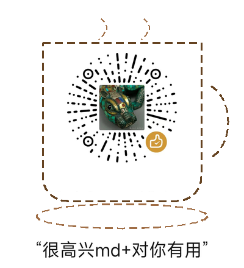

# MD+ — 微信里收到的文档，都能舒服地看

   

MD+ 是一个安卓手机上的本地文档阅读器，专为「微信里收到的文件打不开」这个场景而生：
在微信里点开文件，点「用其它程序打开」，选 MD+，剩下的交给它。

没有广告，不索取任何权限，完全不联网，界面简单顺手、单手可用。

## 下载

- **Gitee 下载（国内直连快）**：<https://gitee.com/bill_zzx/mdp/releases>

现代手机选 arm64 包即可（更小，约 25 MB）。之前装过测试版的话，先卸载再装正式版。

## 它能做什么

- **五种格式都能看**：Markdown、TXT、PDF、EPUB 电子书、Word 文档
- **划线和高亮**：长按文字即可标注，自动保存，随时翻回来看
- **全文搜索**：关键词在第几处，一键直达
- **目录跳转**：长文档、电子书按章节直接翻
- **记住进度**：下次打开，接着上次看到的地方继续
- **六种阅读主题**：四种护眼配色，深浅色可跟随系统；字号随意调

## 完全离线，不碰你的隐私

MD+ 没有申请任何手机权限——包括联网权限。它上不了网，也读不到你的其他文件；
你的文档和标注只保存在手机本地，卸载即全部删除。无广告、无统计、无推送。

- [隐私政策](https://gitee.com/bill_zzx/mdp/blob/master/publish/隐私政策.md)
- [用户服务协议](https://gitee.com/bill_zzx/mdp/blob/master/publish/用户服务协议.md)
- [权限使用说明](https://gitee.com/bill_zzx/mdp/blob/master/publish/权限使用说明.md)

## 请开发者喝一口咖啡 ☕

如果 MD+ 帮到了你，欢迎扫码赞赏——只要 1 元，完全自愿。不为收钱，
只想统计一下它对多少人有用，感谢支持！

| 请喝一口咖啡 ☕ |
|------|
|  |

## 更多

- [使用说明](使用说明.md) —— 详细用法与完整版本历史
- [版权声明](https://gitee.com/bill_zzx/mdp/blob/master/publish/版权声明.md)

本软件开源，采用 [MIT 许可证](LICENSE) · © 2026 bill_zzx
